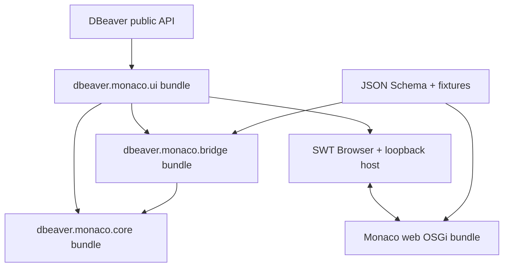
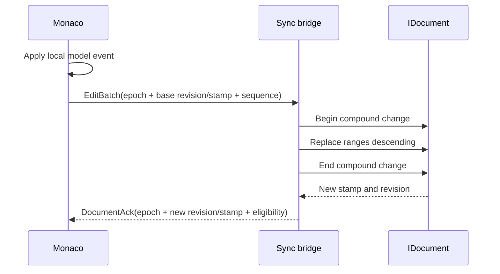
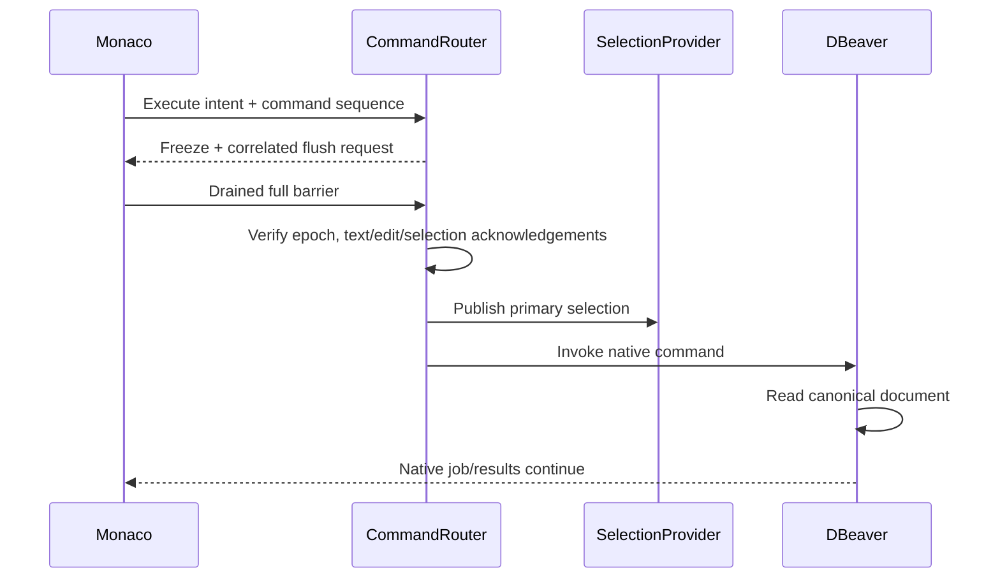

# DBeaver Monaco Editor — Approved Design

| Field | Value |
| --- | --- |
| Status | Approved for implementation |
| Date | 2026-07-31 |
| License | Apache License 2.0 |
| Minimum DBeaver | 26.1.0 |
| Minimum compile platform | Exact Eclipse 2026-03 bundle set shipped by DBeaver 26.1.0 |
| Platforms | Windows, macOS, Linux |

## 1. Product statement

DBeaver Monaco Editor adds Monaco as an alternative editing presentation inside
each existing DBeaver SQL Editor. It provides a VS Code-like code-editing
experience without replacing DBeaver's document, connection, SQL execution,
transaction, or result-grid behavior.

The user can switch the same editor input between `Native` and `Monaco`.

## 2. MVP acceptance outcome

The first useful vertical slice must demonstrate all of the following in a
real DBeaver CE installation:

1. An existing SQL Editor can switch from Native to Monaco and back.
2. Monaco displays the canonical SQL text and primary selection.
3. Typing, paste, `Ctrl+D`/`Cmd+D`, multiple cursors, wheel scrolling,
   minimap, find, navigation, undo, and redo behave as defined.
4. Edits update DBeaver's `IDocument` without echo or lost text.
5. `Ctrl+S`/`Cmd+S` invokes native save.
6. `Ctrl+Enter`/`Cmd+Enter` invokes native DBeaver SQL execution.
7. The primary selected SQL executes when a selection exists.
8. Results appear in the native DBeaver result grid.
9. Browser or bridge failure leaves the native editor and canonical document
   usable.
10. The same p2 feature installs on supported Windows, macOS, and Linux
    DBeaver installations.

## 3. Goals and non-goals

### Goals

- Preserve familiar Monaco/VS Code editing behavior.
- Reuse DBeaver's SQL execution and result lifecycle.
- Keep source boundaries small, testable, and resilient to DBeaver updates.
- Make incompatibility visible before a Monaco model accepts input.
- Degrade optional intelligence independently.
- Distribute a normal, reproducible, signed Eclipse p2 feature.

### Non-goals for MVP

- Reimplement JDBC, execution contexts, transactions, explain plans, or result
  rendering.
- Fork or patch DBeaver.
- Bundle Chromium, Electron, or Node.js at runtime.
- Load Monaco or workers from a CDN.
- Reproduce DBeaver-aware completion, diagnostics, hover, navigation, or a
  second formatting engine in the first vertical slice. A captured public
  native DBeaver format command may be reused through the guarded barrier.
- Execute every Monaco multi-selection as separate SQL in MVP; only the
  primary selection participates in native execution.

## 4. Context and constraints

- DBeaver CE is Eclipse RCP/OSGi software using Java 21 and Maven/Tycho.
- DBeaver exposes an alternate SQL presentation extension:
  `org.jkiss.dbeaver.sqlPresentation`.
- DBeaver save, dirty state, selection, execution, and external resource
  updates are based on Eclipse `IDocument`.
- Monaco is a browser editor whose `ITextModel` and workers require a web
  origin.
- SWT Browser implementation differs across operating systems.
- Unknown future breaking API changes cannot be made compatible in advance;
  the safe guarantee is containment and native fallback.
- The released artifact compiles against the checksum-pinned official DBeaver
  CE 26.1.0 product archive and therefore the exact Eclipse bundles it ships.
  The nonexistent historical `update/ce/26.1.0` site and an independent
  Eclipse p2 site are not build inputs. Compatibility checks run against newer
  complete DBeaver products.

## 5. Architectural decision



The dependency direction is `ui -> bridge -> core`; UI may also consume core
ports directly. `core` is pure Java 21 production code with no DBeaver,
Eclipse, SWT, OSGi service, or JSON implementation imports. The core bundle
may contain OSGi metadata but its Java logic remains platform-independent.
The bridge bundle is the only Java module that owns JSON validation,
wire/domain mapping, and privately packaged JSON dependencies.

### Planned modules

| Module | Responsibility |
| --- | --- |
| `bundles/io.github.bakhtiiartashbolotov.dbeaver.monaco.core` | Session state machine, revisions, synchronization decisions, ports, capability model, stable failures |
| `bundles/io.github.bakhtiiartashbolotov.dbeaver.monaco.bridge` | Explicit private wire envelope, closed-union schema validation, message bounds, exhaustive envelope/domain mapping, private JSON dependency closure |
| `third-party/io.github.bakhtiiartashbolotov.dbeaver.monaco.bridge-json-runtime` | License-preserving private NetworkNT/Jackson aggregate runtime jar embedded only in bridge |
| `bundles/io.github.bakhtiiartashbolotov.dbeaver.monaco.ui` | SQL presentation, DBeaver adapter, selection provider, command router, SWT Browser, loopback server, lifecycle |
| `protocol` | JSON Schema source and cross-language fixtures |
| `web` | Strict TypeScript, Monaco configuration, generated closed types and standalone validator, bridge client, and locally packaged OSGi web assets |
| `releng/io.github.bakhtiiartashbolotov.dbeaver.monaco.target` | Checksum-pinned DBeaver product target definition |
| `releng/io.github.bakhtiiartashbolotov.dbeaver.monaco.test.target` | Test-only overlay with exact JUnit Platform bundles; never shipped |
| `releng/io.github.bakhtiiartashbolotov.dbeaver.monaco.native.test.target` | Profile-only target resolving tests against an explicit verified native product path |
| `features/io.github.bakhtiiartashbolotov.dbeaver.monaco.feature` | Installable feature metadata |
| `features/io.github.bakhtiiartashbolotov.dbeaver.monaco.source.feature` | Matching source feature for every shipped bundle |
| `repository` | p2 repository/category |
| `tests` | Core/property, protocol, PDE/OSGi, browser, compatibility, and leak tests |

### Composition root

`MonacoSQLPresentation` constructs an `EditorLifetimeOwner` for the DBeaver
SQL-editor/document lifetime. That parent owns the circuit-breaker value,
bounded recovery state, and saved view state. Each Native→Monaco attempt
constructs one child `MonacoActivation` with its own Browser, bridge/session,
epoch/replay state, listeners, projection controllers, and physical command
guard. Constructor injection is used throughout; there is no service locator
or global editor/document/browser reference.

The only process-scoped service is a reference-counted
`LoopbackAssetServer`. Every Monaco activation acquires a fresh
`AssetServerLease`/token and releases it idempotently. A lease is never
process-scoped or reused across activations.

The bridge embeds one fixed private aggregate runtime jar on
`Bundle-ClassPath`. NetworkNT/Jackson retain their original package names so
the validator and explicit mapper resolve consistently, but those packages are
neither imported nor exported through OSGi. Service descriptors and notices
are retained, and an installed-bundle test loads the validator through OSGi.
Ordinary Maven classpath success is not accepted as runtime-resolution
evidence.

## 6. DBeaver integration boundary

Register `MonacoSQLPresentation` through
`org.jkiss.dbeaver.sqlPresentation`. Do not use DBeaver internal classes or
invoke `ExtraPresentationManager` directly.

All DBeaver calls pass through:

```java
public interface DBeaverEditorAdapter {
    DocumentPort document();
    SelectionPort selection();
    UndoPort undo();
    CommandPort commands();
    PresentationPort presentation();
    MutationProbePort mutationProbe();
    CapabilityReport probeCapabilities();
}

public interface MutationProbePort {
    ProbeOpenResult openProbe();
}

public sealed interface ProbeOpenResult {
    record Opened(ProbeDocumentLease lease) implements ProbeOpenResult {}
    record Rejected(FailureCode code) implements ProbeOpenResult {}
}

public interface SelectionPort {
    PrimarySelection current();
    SelectionPublishResult publish(PrimarySelection selection);
}

public sealed interface SelectionPublishResult {
    record Published(SelectionAck acknowledgement)
        implements SelectionPublishResult {}
    record Rejected(FailureCode code) implements SelectionPublishResult {}
}

public interface CommandPort {
    CommandResult save(RevisionBarrier barrier);
    CommandResult format(RevisionBarrier barrier);
    CommandResult execute(ExecuteRequest request, RevisionBarrier barrier);
}

public interface ProbeDocumentLease extends AutoCloseable {
    DocumentPort document();
    SelectionPort selection();
    UndoPort undo();
    @Override void close();
}
```

The initial implementation is `DBeaver26EditorAdapter`, built and tested
against the 26.1 line. If a future public contract breaks, add a narrow
version-specific adapter rather than adding version branches throughout the UI
and core.

Prefer public Eclipse command services for save and SQL execution. The plugin
does not create its own SQL execution engine.

DBeaver 26.1.0 exposes public `SQLEditor.showExtraPresentation(String)` and
`showExtraPresentation(SQLPresentationDescriptor)` methods. The adapter uses
the string overload to activate `dbeaver.monaco.presentation` and the nullable
descriptor overload to return to Native. This call remains isolated and
contract-tested in `DBeaver26EditorAdapter`; it never reaches the
package-private `ExtraPresentationManager`.

## 7. Canonical document and two-model synchronization

### Invariants

1. Eclipse `IDocument` is canonical.
2. Monaco `ITextModel` is a projection.
3. Only the SWT UI thread mutates `IDocument`.
4. Bridge offsets are UTF-16 code-unit offsets.
5. Revisions increase monotonically.
6. Text edits are ordered and never dropped or debounced.
7. One Monaco content event is one Eclipse compound change.
8. Multi-edits are applied in descending offset order.
9. Origin guards prevent Java↔Monaco echo.
10. Eclipse's undo manager is authoritative.
11. A command may read text or selection only after a typed flush and matching
    barrier that covers readiness epoch, revision, document stamp,
    acknowledged edit sequence, and acknowledged selection sequence.
12. A full snapshot always flows from `IDocument` to Monaco, never as an
    automatic overwrite in the opposite direction.
13. A partially applied multi-edit is rolled back with captured inverse edits
    and verified against pre-batch text before Native fallback is offered.

### Envelope

Every bridge message has:

```json
{
  "protocolMajor": 1,
  "protocolMinor": 0,
  "sessionId": "opaque-session-id",
  "messageId": "opaque-message-id",
  "kind": "document.editBatch",
  "payload": {}
}
```

Every document, selection, session-mode, flush, and command payload contains
`readinessEpoch`. Every document payload also contains `documentStamp`. Edit
batches contain `baseRevision`, `baseDocumentStamp`, `clientSequence`, and at
most 1,024 ordered edits; acknowledgements contain the new revision and stamp.
Canonical patches contain prior/new revision, prior/new stamp, and ordered
edits.

Acknowledgement direction is explicit: `document.snapshotAck` and
`document.patchAck` flow web→host only after exact non-undoing application;
`document.ack` flows host→web only after a Monaco edit reaches canonical text.
`session.mode` is the only host→web editability control. Integrated boot starts
`READ_ONLY`; only current-epoch `EDITABLE` unlocks input.

Edit, selection, flush, recovery-export, and per-origin command sequences are
epoch-scoped. A snapshot and its acknowledgement explicitly reset edit and
selection sequences to zero. Recovery export requests use a monotonic sequence
and UUID echoed by the response; only the exact current pending response may
authorize candidate storage.

- A protocol-major change is incompatible.
- A protocol-minor change may only add backwards-compatible optional
  capabilities or fields, and still requires a reviewed schema release. The
  initial schema accepts exactly protocol 1.0.
- Every root schema variant is a complete object closed with
  `additionalProperties: false`. Shared scalar constraints are referenced from
  `$defs`; envelope variants are not composed with an `allOf` shape that the
  pinned generator would weaken.
- The schema generates the TypeScript discriminated union. Build-time Ajv
  standalone CommonJS is only an intermediate: exact direct
  `esbuild@0.28.1` bundles it and all pinned helper modules into the
  self-contained browser ESM validator. Java uses one bridge-private envelope
  plus explicit immutable core records. Contract tests compare every envelope
  branch and mapper kind with the schema, then assert the exact mapped record
  for one canonical valid fixture per branch.
- Every TypeScript-visible integer is bounded by
  `Number.MAX_SAFE_INTEGER`; document offsets/lengths are additionally bounded
  by `Integer.MAX_VALUE`.
- Do not use `Map<String, Object>`, TypeScript `any`/`unknown` in the generated
  wire union, open index signatures, raw command strings, or serialized Java
  exceptions.
- Failures use the closed `FailureCode` enum defined authoritatively in Task 2
  of the implementation plan. Later tasks may consume those codes but may not
  silently add one or change the wire union.
- The closed message union includes `session.mode`, distinct
  snapshot/edit/patch acknowledgements, `selection.ack`,
  `barrier.flush.request`/`barrier.flush.response`, and bounded
  `recovery.export.request`/`recovery.export.response`; unknown kinds are
  rejected before envelope construction and domain mapping.
- Command requests carry a monotonic per-epoch `commandSequence`. A bounded
  replay ledger uses a single-use completion permit, returns the cached full
  response/barrier for an exact retry, and rejects sequence/message-ID reuse
  with different content, so SQL/DML handlers are invoked at most once per
  accepted request.

### Monaco edit flow



`BrowserFunction` is synchronous and already runs on the SWT UI thread.
Its implementation must not call `syncExec`. A normal content event remains
small and bounded; view-only events may use a separate coalesced channel.

### Canonical external edit flow

An `IDocument` listener captures native edits, Eclipse undo/redo, reloads, and
other canonical changes. Unless the origin guard identifies the same Monaco
batch, it reserves capacity and captures immutable exact replaced/inserted
segments plus pre/post stamps, not two whole-document copies. The serialized
queue is bounded by both 256 entries and a conservative aggregate 64 MiB
retained UTF-16/metadata budget with overflow-safe reservation and release.
Either overflow freezes the projection and requests recovery capture without
dropping/coalescing text or claiming resync is already authorized.

The listener returns without waiting for JavaScript. A serialized asynchronous
reconciler freezes the projection and uses the shared
`ProjectionFlushCoordinator`. An incremental canonical patch is sent only when
the drained web barrier exactly matches the retained pre-change canonical
state. The web applies it without entering Monaco undo history and returns a
distinct patch acknowledgement. A queued Browser edit, stale pre-state, or
unrepresentable patch preserves the Browser projection as recovery data and
moves the session to resync/fallback instead of silently overwriting it.

### Resynchronization

Permit one automatic full snapshot from `IDocument` while the Monaco editor is
read-only. The first mismatch in `SYNCING`, `READY`, or `DEGRADED` atomically
consumes the SQL-editor-lifetime allowance, freezes the source epoch, blocks
the one physical command guard, revokes its logical lease, and stores a
correlated `CapturingRecovery` transaction. Before any overwrite, the host
drains what it can, requests a UUID/sequence-correlated bounded
`recovery.export`, and commits the validated projection plus high-water marks
to the parent-owned recovery store. Store failure stops in explicit
recovery/Native fallback.

Only an exact opaque committed-candidate handle bound to the current
activation/resync/source/request tuple may atomically increment the epoch,
clear readiness/sequences/replay state, and replace the transaction with
`PreparingSnapshot(targetEpoch, handle, captureId)`. A prepared snapshot must
match all of that authorization; prepared-before-store, wrong handle/capture,
late failure, and duplicate callbacks are typed no-ops. A matching preparation
failure offers the already stored candidate. The reducer clears the
transaction and commits back to `SYNCING` before the single send effect, so an
immediate re-entrant acknowledgement observes the correct state.

Preserve Monaco view state only if restoring it is valid for the new model.
The allowance is not reset after success or a Native round trip. A second
mismatch trips the circuit breaker and enters recovery/fallback; readiness
events are ignored during capture and delayed old-epoch events are typed
no-ops afterward.

The Java host reserves recovery-journal capacity for each validated Monaco
batch before attempting the canonical apply. The journal owns a host-known
checkpoint and later entries. It may compact an acknowledged prefix into that
checkpoint, but never evicts pending or failed entries. If capacity cannot be
reserved, `IDocument` remains unchanged, Monaco freezes read-only, and the
batch is rejected with `RECOVERY_CAPACITY_EXCEEDED`.

Named protocol limits are 64 MiB per bridge envelope, 8 MiB per normal edit
batch, 10 Mi UTF-16 code units per document/recovery text, and 32 MiB/2,048
entries per recovery journal. These limits allow the required 10 MiB fixture
and its worst-case JSON escaping plus envelope overhead while keeping ordinary
edits more tightly bounded. The journal-byte limit includes its retained
checkpoint and all entries.

Protocol eligibility is distinct from recovery/edit eligibility. Before
qualified snapshot readiness, after an external canonical replacement, and
after every acknowledgement/compaction, exact overflow-safe accounting must
prove:

```text
checkpointWireBytes + 8 MiB edit batch + 64 KiB entry metadata
    <= 32 MiB journal
```

The 64 KiB metadata budget is a named constant whose bound is proved against
the closed schema. Every host-to-web `DocumentAck` carries typed
`recoveryEligible`; false freezes further Monaco input and enters explicit
recovery/fallback with `RECOVERY_CAPACITY_EXCEEDED`. The atomic per-batch
reservation remains a second mandatory check. Thus a 10 MiB ASCII fixture is
editable, while a heavily escaped value that fits the outer bridge but not the
journal remains Native-editable only.

While the Browser remains alive, an explicit
`recovery.export` request can return its bounded current text. No design can
recover keystrokes that never reached either journal before a process-level
Browser crash; the UI must state that limitation rather than promise otherwise.

## 8. Undo and redo

Monaco's built-in context menu and quick-command surfaces are disabled where
they could invoke its private undo stack. The plugin supplies typed
keyboard, context-menu, command-palette, and programmatic web-facade actions,
all sent through `UndoPort`; the raw editor command service is not exposed.
Canonical patches use Monaco edit APIs that do not enter its independent undo
history. Eclipse's undo manager changes `IDocument`; the canonical document
event then updates Monaco.

Multi-cursor content events are wrapped with
`IRewriteTarget.beginCompoundChange()` and
`IRewriteTarget.endCompoundChange()`.

Compound undo is a critical startup capability. If it cannot be proven, Monaco
must remain unavailable.

## 9. Selection and command routing

`MonacoSelectionProvider` publishes the exact primary selection in Eclipse
offset/length form together with readiness epoch, document revision, stamp,
and a monotonic selection sequence. Java acknowledges the selection sequence.
A command barrier contains epoch, canonical revision/stamp, acknowledged edit
sequence, and latest semantic selection acknowledgement. Scroll position and
decorative cursor telemetry may be coalesced because commands do not consume
them.

### Command classes

| Class | Examples | Owner |
| --- | --- | --- |
| Monaco local | `Ctrl+D`, find, multicursor, navigation, minimap, scrolling | Monaco |
| Canonical document | save, undo, redo, format | Typed Java `CommandRouter` |
| Native SQL | execute statement/script, explain | DBeaver command handler |
| Native result/transaction | result actions, commit, rollback, export | DBeaver |

JavaScript cannot send an arbitrary Eclipse command ID. The bridge exposes a
closed command allowlist represented by sealed Java types.

While Monaco is active, a scoped `MonacoCommandGuard` activates handlers for
the same public save/undo/redo/execute and discovered format command IDs used
by DBeaver toolbar, menu, and global keybindings. Every web or native surface
enters the same transaction: set read-only, send a correlated flush request,
drain edits/selections, validate the full barrier, then invoke.

A per-epoch replay ledger has independent `WEB` and `NATIVE` monotonic
sequence namespaces. Origin is assigned by the bridge/host and is not a wire
field. A single-use completion permit caches the full immutable
`EditorCommandResponse`, including its applied barrier; an exact retry receives
that response without another flush or handler call. Sequence/message-ID reuse
with different content is rejected. To invoke the original native handler
after acceptance, the guard temporarily removes only its own activation on the
SWT thread, executes the public command once, and restores the activation in
`finally` under a reentrancy guard. Hiding/deactivating Monaco disposes every
activation.

There is one physical guard activation per Monaco activation. Resync moves it
to blocking mode before asynchronous capture, revokes the old logical lease,
and keeps the handlers intercepted. After current-epoch snapshot, recovery,
and mutation evidence, the capability probe atomically rebinds that same guard
to a fresh lease; it never installs a second activation. Exact stored-lease
loss is critical in `SYNCING` as well as editable states.
A missing format surface disables only that optional action; an existing
mutating format surface that cannot be guarded blocks editable Monaco.

`CommandRouter.dispatch` returns a `CompletionStage` immediately after
validation/enqueue. The synchronous `BrowserFunction` never waits for the
flush; the correlated command response is sent only when the asynchronous
transaction completes.

### Execute flow



Toolbar and menu commands remain safe because the original handler cannot run
until the Browser queue is frozen/drained and Java has acknowledged current
canonical text and selection.

## 10. Presentation switching

### Monaco to Native

1. Send read-only mode and the same correlated flush used by native commands.
2. Verify the epoch/revision/stamp/edit/selection barrier.
3. Save Monaco view state and primary selection.
4. Deactivate the Monaco selection provider.
5. Show the native presentation backed by the same `IDocument`.
6. Restore a valid caret/selection and focus.

### Native to Monaco

1. Capture the canonical document stamp, dirty state, and native selection.
2. Reuse the projection only when revisions match.
3. Otherwise send a canonical full snapshot.
4. Restore valid Monaco view state.
5. Activate `MonacoSelectionProvider`.

If the barrier fails, do not switch silently. Offer retry, copy recovery text,
or switch using the canonical document.

`PresentationPort`, implemented only by the DBeaver adapter, owns requests to
activate either presentation. Recovery code never reaches into
`SQLEditor`/`ExtraPresentationManager` directly.

DBeaver's own presentation handler reaches synchronous
`canHidePresentation`/`canShowPresentation` hooks, so those hooks are part of
the same controller boundary. An external request freezes the source, queues
the asynchronous switch transaction after the callback, and immediately
returns `false`. Once flush and barrier verification succeed, the controller
arms an internal session- and target-bound one-shot permit and invokes the
public `PresentationPort`; the relevant hook consumes the permit and returns
`true`. The permit is cleared in `finally` and cannot be supplied through the
bridge.

Switching has a local transaction phase, separate from `SessionState`:
`IDLE`, `FREEZING_SOURCE`, `VERIFYING_BARRIER`, `ACTIVATING_TARGET`,
`RESTORING_VIEW`, or `FAILED`. Repeated native clicks coalesce into the current
transaction; a stale completion from another session is ignored.

## 11. Lifecycle and concurrency

Approved session states:

```text
NEW -> PROBING -> LOADING -> HANDSHAKING -> SYNCING -> READY
                                                        |
                              RESYNCING / DEGRADED / FAILED
                                                        |
                                                     DISPOSED
```

The actual transition table is implemented as a deterministic core state
machine receiving typed events and emitting state plus effects. It is tested
without SWT or DBeaver.

`DISPOSED` is terminal and absorbs every late callback without effects.
`FAILED` likewise absorbs everything except one final `DisposeRequested`.
Resource disposal and destructive fallback effects execute at most once.

The session context records a monotonic readiness epoch, pending
snapshot/checkpoint stamps, one current document-readiness stamp, an
epoch-bound mutation proof, and an epoch/lease-ID-bound live command guard.
Initial document readiness exists only when snapshot acknowledgement and
recovery evidence carry the same `(epoch, revision, documentStamp)`. Evidence
from different epochs/snapshots never combines. Qualified document readiness
and a successful mutation-channel plus compound-undo probe both remain
read-only in `SYNCING`.
The probe uses a disposable throwaway document/viewer/undo manager produced
through the same adapter factory and never mutates the user's SQL document or
undo stack. Only after the native save/undo/redo/statement/script routes and
the scoped command guard are also proven may the readiness reducer emit
`EnableEditing` and enter `READY` (or `DEGRADED` when only optional
capabilities are disabled).

Readiness events are idempotent and order-independent; exactly one transition
enables editing when all three facts are true. After an edit or acknowledged
canonical patch, `DocumentReadinessAdvanced` atomically moves only the current
document stamp and preserves same-epoch mutation/guard facts. A full resync
increments the epoch and clears all facts before snapshot preparation. Delayed
old-epoch events are no-ops; same-epoch advancement must match the sync
controller's current canonical state, headroom loss must match the stored
stamp, and guard loss must match the exact lease ID. Command readiness
survives only while that guard remains installed; losing the exact recorded
lease is a critical failure even while the reducer is still `SYNCING` and
other facts have not arrived. Resync clears the logical lease and requires the
same-activation rebind described above. Production editability is communicated
only through typed `session.mode`.

Concurrency rules:

- SWT UI thread is the only document writer.
- Java-to-JavaScript updates never block the UI waiting for a JavaScript
  promise.
- Background completion/hover jobs receive immutable snapshots and revision
  values, not DBeaver UI objects.
- Optional intelligence uses cancellation and latest-wins behavior.
- Stale asynchronous results are discarded by epoch and revision.
- Revision barriers are state checks, not locks or cyclic waits.

## 12. Capability and compatibility model

### Critical capabilities

- supported SWT Browser and JavaScript execution;
- loopback page and worker loading;
- bidirectional typed bridge;
- canonical document snapshot and incremental mutation;
- semantic selection;
- compound undo;
- projection freeze/drain and full revision barrier;
- native save, undo, redo, and execute command routing plus scoped guard.

Missing any critical capability prevents every editable state. `DEGRADED` is
editable only when all critical capabilities pass and one or more optional
features are disabled.

### Optional capabilities

- theme synchronization;
- minimap on large files;
- DBeaver-aware completion;
- hover;
- formatting;
- diagnostics and navigation.

Optional capabilities negotiate and fail independently.
Native formatting is optional only when no mutating format surface exists. If
such a surface exists, it must be captured and guarded through the typed
`Format` route; an unguardable surface is a critical compatibility failure.

### Compatibility gates

1. Minimum product and bundle version checks.
2. OSGi resolution using public/exported packages.
3. Runtime API and functional probes.
4. Protocol handshake.
5. Canonical snapshot acknowledgement plus recovery-checkpoint headroom.
6. Throwaway-document mutation and compound-undo proof.
7. Native command-route and scoped-guard proof.

OSGi semantic ranges are a coarse gate. Capability probes and the CI
compatibility matrix are the behavioral guard.

The release compiles against one immutable 26.1.0 product, but its runtime
manifest does not exact-match a DBeaver product string or bundle qualifier.
Imports use bounded ranges anchored to the verified minimum public API.
Compatible patches such as 26.1.3 therefore resolve and are admitted by
functional probes; a changed contract selects another adapter or disables
Monaco without affecting Native.

A `LinkageError` may be caught only at the DBeaver adapter boundary and must
produce a stable incompatibility report. Do not broadly catch `Throwable`.

The plugin must activate lazily. Startup or static initializers must not touch
DBeaver editor APIs.

## 13. Browser host and security

`SwtBrowserHost` loads a page from a `LoopbackAssetServer` bound using the
literal IPv4 bytes `{127, 0, 0, 1}` on a random port, without hostname
resolution.

Required controls:

- unguessable per-session URL token generated, owned, and destroyed by the
  asset-server lease; callers cannot supply one;
- the exact signed-bundle policy from
  `web/security/content-security-policy.txt`:

  ```text
  default-src 'none'; base-uri 'none'; object-src 'none'; frame-ancestors 'none'; form-action 'none'; script-src 'self'; style-src 'self' 'unsafe-inline'; img-src 'self' data: blob:; font-src 'self' data:; connect-src 'self'; worker-src 'self' blob:
  ```

- no `unsafe-eval`, dynamic `Function`, or runtime schema compilation;
- no external scripts, styles, fonts, frames, connections, or navigation;
- local ESM Monaco, worker assets, and the build-generated Ajv standalone
  validator; pinned local Ajv runtime helpers are allowed;
- origin, session, schema, message-kind, and size validation;
- Java command allowlist;
- bounded message sizes and bounded diagnostic output;
- fixed JSON parser depth, decoded-string, and number-length limits before
  schema mapping;
- no CORS access for unrelated origins;
- no SQL, credentials, connection URL, DB object names, or raw payload in logs;
- committed npm lockfile, dependency audit, SBOM, license inventory, privately
  packaged bridge dependency closure, and signed release artifacts.

Because the browser validator embeds selected `ajv@8.20.0` helper code, Ajv is
a production lockfile/SBOM/license component even though schema compilation is
build-time-only. The esbuild metafile records the exact included helpers;
generator, bundler, parser, and scope-analysis packages remain build-only.

The plugin must not expose a general-purpose local web server or arbitrary file
reader.

Release signing occurs before p2 metadata is generated. Every binary and
source plugin/feature JAR is verified with strict `jarsigner` checks and an
allowlisted certificate fingerprint; SHA-256 manifests are produced only
after signing. GitHub provenance may supplement, but cannot replace, the JAR
signatures.

Compatibility evidence is artifact-bound. One p2 ZIP is built, hashed,
transported to every matrix row, installed into a checksum-cloned DBeaver
product, and tested there with no production bundle supplied by the test
reactor. Release repeats the matrix with the exact signed p2 bytes; evidence
records that digest, and assembly only copies those tested bytes. Missing,
duplicate, partial, or mixed-digest rows fail aggregation.

Stable compatibility runs on pull requests, pushes to `main`, and manual
dispatch under workflow-level `contents: read`; its aggregate job is required.
The scheduled newest/devel target is isolated in a warning-only canary.

Release transport separates five publishable signed-build payloads from
effective-version/commit metadata and per-file sidecars. Assembly verifies but
never copies transport metadata. Final `dist/` contains exactly the versioned
p2 ZIP, source ZIP, Maven/web CycloneDX files, license inventory,
commit-bound compatibility ZIP, and `SHA256SUMS`; that manifest covers the
first six files. Optional provenance is created outside `dist/` afterward.

## 14. Disposal and ownership

Every Monaco activation owns an idempotent `DisposableScope` that releases in
reverse order:

1. background jobs and cancellation sources;
2. document and selection listeners;
3. bridge functions and browser callbacks;
4. Monaco model/subscriptions through the bridge;
5. Browser control;
6. asset-server lease.

Before fatal fallback disposal, unresolved bounded journal/checkpoint and
committed candidate handles are transferred to the parent
`EditorLifetimeOwner`. A clean switch may erase only fully acknowledged
activation entries after proving no unresolved projection candidate. The
parent keeps the latest circuit-breaker value and unresolved recovery
material across Native↔Monaco switches; explicit resolution/discard erases the
selected material, and SQL-editor close erases all remaining buffers and then
disposes the owner.

There are no static references to editor, document, browser, selection
provider, jobs, bridge session, or recovery candidate. Repeated activation
switches must leave one or zero live activation scopes as appropriate, and a
repeated SQL-editor open/close test must observe no live owner/session/listener
after collection.

## 15. Performance budgets

These are acceptance budgets measured in a dedicated, repeatable performance
workflow, not inferred from a single fast run. Java latency numbers traverse
the checksum-pinned native product's real
`Monaco → SWT BrowserFunction → IDocument → acknowledgement/patch` path under
a real display. Standalone Playwright supplies only render and scroll-frame
measurements.

Each of two independent samples measures 20 fresh editor/Browser cold sessions
per fixture, which supplies the empirical nearest-rank p95 population. Warm
metrics use one unmeasured warm-up followed by three measured runs containing
200 events per bridge operation and 300 scroll frames. Percentiles are
calculated from raw observations, not three run summaries. Missing samples,
timer anomalies, test errors, and leaks fail immediately; the same budget must
breach in both samples to classify a performance regression.

| Scenario | 1 MiB | 10 MiB |
| --- | ---: | ---: |
| Cold snapshot to read-only render, p95 | <= 3 s | <= 10 s |
| Edit acknowledgement, p95 / p99 | <= 50 / 100 ms | <= 120 / 250 ms |
| Selection acknowledgement, p95 / p99 | <= 30 / 75 ms | <= 50 / 120 ms |
| Canonical patch, p95 / p99 | <= 60 / 120 ms | <= 150 / 300 ms |
| Scroll frame, p95 | <= 33 ms | <= 50 ms |
| Steady-state text edit | No full snapshot | No full snapshot |

One hundred activation and SQL-editor open/close cycles must retain no
lifetime owner, activation session, listener, model, worker, Browser callback,
or asset-server lease.

Large-document mode may disable minimap, semantic diagnostics, or expensive
full-document tokenization. Basic editing, save, and native execution remain
available.

## 16. Diagnostics

Expose a copyable compatibility report containing:

- plugin, DBeaver, Eclipse, Java, OS, and Browser versions;
- protocol major/minor;
- adapter ID;
- critical and optional capability status;
- stable failure codes;
- bridge latency aggregates;
- resync and circuit-breaker counters.
- bridge message accept/reject counts.

The report contains no SQL or connection-sensitive data.

## 17. Testing strategy

| Layer | Required evidence |
| --- | --- |
| Pure core | Unit and state-transition tests |
| Synchronization | Property tests with random insert/delete/replace, surrogate pairs, multicursor, external edits, and undo |
| Protocol | One valid fixture per closed-union branch plus shared invalid/boundary fixtures consumed by Ajv, NetworkNT, and the exact Java mapper |
| Web | Unit tests plus Playwright for keybindings, multiple cursors, paste, wheel, find, navigation, all undo surfaces, model disposal, and worker teardown |
| UI adapter | PDE/JUnit tests for document, selection, undo, command routing, capability probes, and disposal |
| End-to-end | SWTBot or equivalent real DBeaver launch/install/execute smoke tests |
| Compatibility | DBeaver 26.1.0 and 26.1.3; weekly latest/devel canary |
| Platforms | Windows, macOS Intel/ARM where available, Linux GTK |
| Security | npm audit, dependency review, SBOM, license scan, malformed bridge fuzzing |
| Performance | 1 MiB/10 MiB startup, edit latency, open/close leak test |

Compile the released plugin against the minimum supported target. Run it
against both minimum and newest verified targets. A canary failure warns about
future compatibility but does not weaken stable branch checks.

Default `./mvnw verify` owns headless/mock tests only, with no disabled native
tests. Real-display SWT suites live in a separate module activated by
`-Pnative-ui`; installed-DBeaver product suites use `-Pnative-e2e`. Their exact
JUnit/jqwik/H2 dependencies are test-only and excluded from runtime features
and repository metadata. The `-Pperformance` profile also consumes the native
target, an absolute checksum-pinned DBeaver product path, the UI harness, and
a real display for bridge/document metrics.

## 18. Delivery stages

1. Reproducible Tycho/npm scaffold and pinned DBeaver target.
2. Typed protocol and pure-core lifecycle.
3. Standalone Monaco web behavior and asset bundle.
4. SWT Browser/loopback feasibility checkpoint.
5. DBeaver SQL presentation and initial snapshot.
6. Incremental synchronization and compound-undo proof, still read-only.
7. Native save and primary-selection execution; enable editing only after the
   command-channel proof.
8. Bidirectional presentation switching and safe Native fallback.
9. Recovery, diagnostics, performance, and leak hardening.
10. Signed cross-platform p2 packaging and compatibility CI.
11. Later plans: theme parity and DBeaver intelligence ports.

Each stage is one review gate. Do not begin the next stage automatically.

## 19. Key risks and mitigations

| Risk | Mitigation |
| --- | --- |
| SWT Browser differences | Early cross-platform go/no-go spike and critical capability probe |
| DBeaver API changes | Public APIs only, isolated adapter, minimum/latest CI, native fallback |
| Two-model divergence | One canonical model, revision/stamp checks, property tests, one-way resync |
| Dual undo histories | Eclipse-only undo and compound-change probe |
| UI-thread latency | Incremental bounded batches and measured latency budgets |
| Browser compromise | Local assets, CSP, token, origin/schema/size validation, command allowlist |
| Resource leaks | Explicit ownership graph, idempotent disposal, repeated lifecycle test |
| Dependency risk | Pinned lockfile, DOMPurify security override validation, audit/SBOM/license gates |

## 20. Definition of MVP complete

MVP is complete only when:

- the feature installs from a generated p2 repository;
- all ten acceptance outcomes in section 2 are demonstrated;
- minimum/current DBeaver and all three OS families pass required checks;
- synchronization property tests and bridge contract fixtures pass;
- no critical production vulnerability remains unresolved;
- no prohibited internal API or core-layer dependency exists;
- native DBeaver remains usable in every tested failure path;
- documentation and compatibility report describe the verified support matrix.

## 21. Primary sources

- [DBeaver CE 26.1.0 official product archive](https://dbeaver.io/files/26.1.0/)
- [DBeaver CE 26.1.0 exact official Linux checksum](https://downloads.dbeaver.net/community/26.1.0/checksum/dbeaver-ce-26.1.0-linux-x86_64.tar.gz.sha256)
- [DBeaver 26.1 release and Eclipse 2026-03 baseline](https://dbeaver.io/2026/05/31/dbeaver-26-1/)
- [DBeaver 26.1.3 release](https://dbeaver.io/2026/07/19/dbeaver-26-1-3/)
- [DBeaver 26.1.0 SQL presentation extension point](https://github.com/dbeaver/dbeaver/blob/26.1.0/plugins/org.jkiss.dbeaver.ui.editors.sql/schema/org.jkiss.dbeaver.sqlPresentation.exsd)
- [DBeaver 26.1.0 SQL presentation registration](https://github.com/dbeaver/dbeaver/blob/26.1.0/plugins/org.jkiss.dbeaver.ui.editors.sql/plugin.xml)
- [DBeaver 26.1.0 `SQLEditorPresentation`](https://github.com/dbeaver/dbeaver/blob/26.1.0/plugins/org.jkiss.dbeaver.ui.editors.sql/src/org/jkiss/dbeaver/ui/editors/sql/SQLEditorPresentation.java)
- [DBeaver 26.1.0 `ExtraPresentationManager`](https://github.com/dbeaver/dbeaver/blob/26.1.0/plugins/org.jkiss.dbeaver.ui.editors.sql/src/org/jkiss/dbeaver/ui/editors/sql/ExtraPresentationManager.java)
- [DBeaver 26.1.0 `SQLEditor`](https://github.com/dbeaver/dbeaver/blob/26.1.0/plugins/org.jkiss.dbeaver.ui.editors.sql/src/org/jkiss/dbeaver/ui/editors/sql/SQLEditor.java)
- [DBeaver 26.1.0 presentation switch handler](https://github.com/dbeaver/dbeaver/blob/26.1.0/plugins/org.jkiss.dbeaver.ui.editors.sql/src/org/jkiss/dbeaver/ui/editors/sql/handlers/SQLEditorHandlerSwitchPresentation.java)
- [DBeaver agent/build guidance](https://github.com/dbeaver/dbeaver/blob/devel/AGENTS.md)
- [External YDB DBeaver plugin Tycho structure](https://github.com/ydb-platform/ydb-dbeaver-plugin/blob/main/pom.xml)
- [DBeaver 26.0.1 migration to Eclipse 2026-03](https://dbeaver.io/2026/03/22/dbeaver-26-0-1/)
- [DBeaver 26.1.1 migration to Eclipse 2026-05](https://dbeaver.io/2026/06/21/dbeaver-26-1-1/)
- [Monaco Editor](https://github.com/microsoft/monaco-editor)
- [Eclipse `IDocument`](https://help.eclipse.org/latest/topic/org.eclipse.platform.doc.isv/reference/api/org/eclipse/jface/text/IDocument.html)
- [Eclipse `IDocumentExtension4`](https://help.eclipse.org/latest/topic/org.eclipse.platform.doc.isv/reference/api/org/eclipse/jface/text/IDocumentExtension4.html)
- [Eclipse `IRewriteTarget`](https://help.eclipse.org/latest/topic/org.eclipse.platform.doc.isv/reference/api/org/eclipse/jface/text/IRewriteTarget.html)
- [Eclipse `IUndoManager`](https://help.eclipse.org/latest/topic/org.eclipse.platform.doc.isv/reference/api/org/eclipse/jface/text/IUndoManager.html)
- [OSGi semantic versioning importer policy](https://docs.osgi.org/whitepaper/semantic-versioning/060-importer-policy.html)
- [Eclipse Tycho](https://github.com/eclipse-tycho/tycho)
- [Tycho 5.0.3 documentation](https://tycho.eclipseprojects.io/doc/5.0.3/)
- [GitHub-hosted runner images and architecture labels](https://github.com/actions/runner-images#available-images)
- [GitHub Actions secure-use guidance](https://docs.github.com/en/actions/reference/security/secure-use)
- [Playwright browser installation and CDN behavior](https://playwright.dev/docs/browsers)
- [Ajv JSON Schema draft 2020-12 configuration](https://ajv.js.org/json-schema.html#draft-2020-12)
- [Ajv standalone validation code](https://ajv.js.org/standalone.html)
- [Ajv standalone ESM runtime-helper issue](https://github.com/ajv-validator/ajv/issues/2209)
- [esbuild JavaScript build API](https://esbuild.github.io/api/#build)
- [NetworkNT 2.0.4 draft 2020-12 quick start](https://github.com/networknt/json-schema-validator/blob/2.0.4/doc/quickstart.md)
- [Apache Maven 3.9.16](https://maven.apache.org/download.cgi)
- [Apache Maven Wrapper Plugin 3.3.4](https://maven.apache.org/tools/wrapper/maven-wrapper-plugin/wrapper-mojo.html)
- [Node.js 24.18.1](https://nodejs.org/en/blog/release/v24.18.1)
